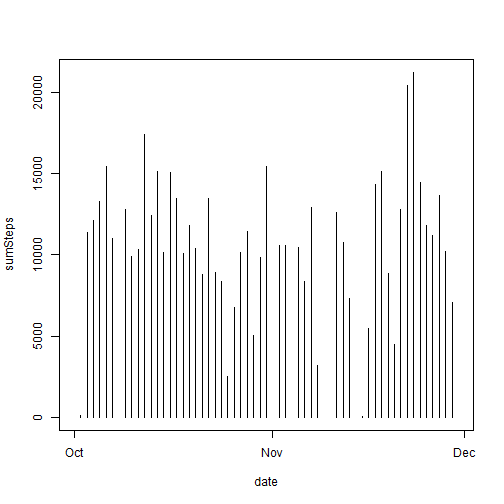
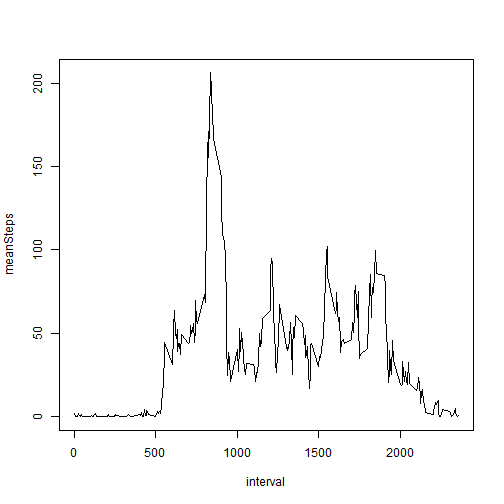
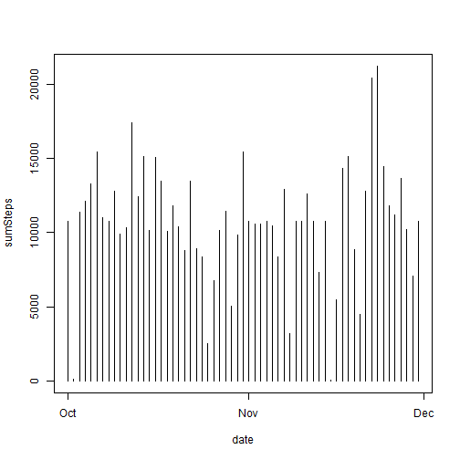
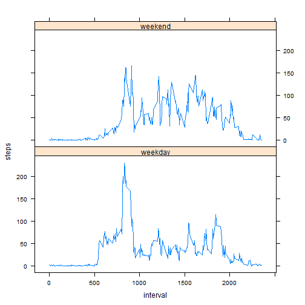

Reproducible Research Assignment 1
==================================
C. Vlad  
*July 16, 2014*

## Executive summary

This study on data from a personal activity monitoring device is made in the context of the first assignment of the Coursera class on Reproducible Research teached by Roger D. Peng, PhD, Jeff Leek, PhD, Brian Caffo, PhD

## Loading and preprocessing the data

Loading libraries

```r
library(dplyr)
library(lattice)
```

Loading data in the *activity* table and transforming the *date* column in *POSIXct* format.
Creating aggregations by date and by interval.


```r
# reading data
activity <- read.csv("activity.csv", as.is = TRUE)

# transforming date
activity$date <- as.POSIXct (activity$date, format="%Y-%m-%d")

# aggregating by date
groupByDate <- group_by(activity, date)
aggByDate <- summarise(groupByDate,
                       sumSteps = sum(steps),
                       meanSteps = mean(steps),
                       medianSteps = median(steps)
                       )

# aggregating by interval
groupByInterval <- group_by(activity, interval)
aggByInterval <- summarise(groupByInterval,
                       meanSteps = mean(steps, na.rm = TRUE)
                       )
```

## What is mean total number of steps taken per day?


```r
# total number of spots per day
with(aggByDate, plot(date, sumSteps, type="h"))
```

 

Calculating mean and median total number of spots per day

```r
meanTotalSteps <- mean(aggByDate$sumSteps, na.rm = TRUE)
medianTotalSteps <- median(aggByDate$sumSteps, na.rm = TRUE)
```

Mean total number of steps taken per day is 1.0766 &times; 10<sup>4</sup>.
Median total number of steps taken per day is 10765.

## What is the average daily activity pattern?

Mean number of steps by interval on the days of the study

```r
with(aggByInterval, plot(interval, meanSteps, type="l"))
```

 

Finding maximum mean number of steps by interval

```r
maxMeanStepsByIntervalIndex <- which.max(aggByInterval$meanSteps)
maxMeanStepsByInterval <- aggByInterval$meanSteps[maxMeanStepsByIntervalIndex]
intervalWithMaxMeanSteps <- aggByInterval$interval[maxMeanStepsByIntervalIndex]
```
Maximum mean number of steps by interval is 206.1698 and is obtained for interval 835.

## Imputing missing values
Calculating total number of rows with missing values in the dataset

```r
# activity.completeCases[i] == TRUE <=> activity[i,] does not contain NAs
activity.completeCases <- complete.cases(activity)

# calculating total number of rows with missing values
totRowsWithMissingValues <- length(activity.completeCases[activity.completeCases == FALSE])
```
Total number of rows with missing values in the dataset is 2304.

Are there rows with missing dates or intervals ?

```r
nbRowsWithMissingDate <- length(activity$date[is.na(activity$date) == TRUE])
nbRowsWithMissingInterval <- length(activity$interval[is.na(activity$interval) == TRUE])
```
There are 0 rows with missing dates and 0 rows with missing intervals. Hence all missing values are on *steps*.

Creating a new dataset identical to *activity*, with missing steps replaced by the mean steps for the interval rounded to integer.

```r
activity.imputed <- activity
activity.imputed$steps <- sapply(1:nrow(activity),
                                 function(i) {
                                     if(is.na(activity$steps[i]))
                                         round(aggByInterval$meanSteps
                                               [aggByInterval$interval == activity$interval[i]])
                                     else
                                         activity$steps[i]
                                     }
                                 )
```

Aggregating the dataset with imputed missing values


```r
groupByDate.imputed <- group_by(activity.imputed, date)
aggByDate.imputed <- summarise(groupByDate.imputed,
                       sumSteps = sum(steps),
                       meanSteps = mean(steps),
                       medianSteps = median(steps)
                       )
```

Histogram of the total number of steps taken each day

```r
with(aggByDate.imputed, plot(date, sumSteps, type="h"))
```

 

Calculating the mean and median total number of steps taken per day

```r
meanTotalSteps.imputed <- mean(aggByDate.imputed$sumSteps)
medianTotalSteps.imputed <- median(aggByDate.imputed$sumSteps)
percentageChangeMedianTotalSteps <- (medianTotalSteps - medianTotalSteps.imputed) / medianTotalSteps * 100
```

After missing values imputation, the mean total number of steps taken per day is 1.0766 &times; 10<sup>4</sup> and the median total number of steps taken per day is 1.0762 &times; 10<sup>4</sup>.

After imputation, the mean total number of steps taken per day remains unchanged, while the median drops by 0.0279%.

## Are there differences in activity patterns between weekdays and weekends?

Creating a new factor variable in the dataset with two levels - "weekday" and "weekend" indicating whether a given date is a weekday or weekend day.

```r
activity.imputed$weekdayType <- 
as.factor(sapply(weekdays(activity$date, abbreviate=TRUE),
                 function(D) {if(D %in% c("Sun", "Sat") ) "weekend" else "weekday"}))
```

Plotting average number of steps by interval accross weekdate type.

```r
# aggregating on weekdayType and interval
aggAI.WdtI <- aggregate(steps ~ weekdayType + interval, data = activity.imputed, FUN = mean)
xyplot(steps ~ interval | weekdayType, data = aggAI.WdtI, type="l", layout = c(1, 2))
```

 
